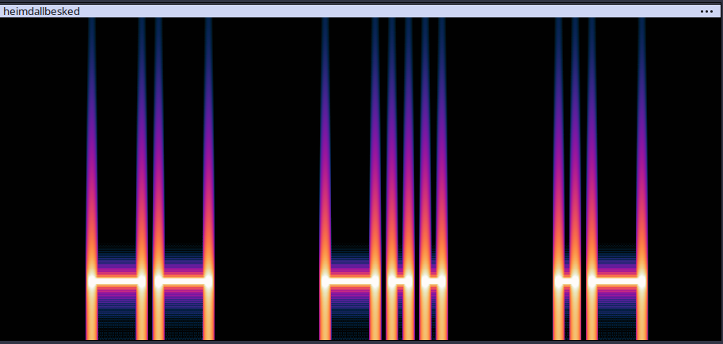

# Opgave
Heimdall har forsøgt at sende en besked til Odin. Dog er filen kommet i de forkerte hænder og måske har jætterne pillet lidt ved filen. Odin har aldrig modtaget filen. Måske du kan hjælpe med at finde ud af hvorfor filen ikke virker? og hvad er det helt præcist er blevet sendt fra Heimdall til Odin?

vedhæftet fil: heimdallbesked.7z 

---

# Løsning

Jeg unzipper filen hvori der ligger **heimdallbesked.wav**

Jeg forsøger at åbne filen i Audacity, men får fejl om at det er en forkert filtype. Dette plejer at betyde der er fejl i headeren i filen.

Jeg åbner **heimdallbesked.wav** i Hexedit og sammenligner det med den .wav fil der var givet til dag 4. Her er det meget tydeligt at se at første og tredje del af headeren er forkert.

25 94 64 64  B0 D6 6F 00  75 14 65 56 (Heimdallbesked.wav)
52 49 46 46  E8 DA 1B 00  57 41 56 45 (wav fil fra dag 4)

Første 4 tal i en .wav fil angiver at der er RIFF format og tal 9-13 angiver at det er WAVE format. Tal 5-8 angiver størrelsen på filen så den kan vi ignorer.

Ud fra sammenligningen kan man se at tallene mere eller mindre bare skal byttes rundt og efter dette kan den åbnes i Audacity.

Jeg afspiller filen og finder hurtigt ud af at det er morsekode man kan hører. Morsekode kan afkodes relativt nemt hvis man ændrer måden den viser frekvenserne på til et **spectogram** som på billedet.

De brede er - mens de smalle er .
Afkoder man dette får man (Tilføjet mellemrum for at gøre det lettere at læse): **HEIMDALL S PRØVEDE T AT E SCANNE G PORTENE A TIL N BIFROST, O MEN G BLEV R HURTIGT A BANNED P FOR H AT Y LAVE X ALT Y FOR Z MEGET Å LARM.**

Herfra får vi sætningen: **HEIMDALL PRØVEDE AT SCANNE PORTENE TIL BIFROST, MEN BLEV HURTIGT BANNED FOR AT LAVE ALT FOR MEGET LARM.**
og sætningen: **STEGANOGRAPHY XYZÅ**

Jeg prøvede begge disse som flag, men ingen var korrekte.

Jeg tænkte så derefter at kombinationer af sætninger kunne var passphrases til at extract flaget fra .wav filen, men dette virkede heller ikke.

Jeg forsøgte derfor at google lidt omkring hvordan man kan gemme data i en .wav fil og fandt python library **stego-lsb**, som kan extracte data fra en .wav fil hvis den bruger **least significant bit** til at gemme data.

Least significant bit er hvis man ændrer den bit der giver mindst information, og dermed gør næsten ingen forskel til noget andet. Er filen lang nok har den nok LSB til at man kan gemme en del data i dem.

Jeg kører derfor kommandoen `stegolsb wavsteg -r -i heimdallbesked.wav -o output.txt -b 100`

I output.txt ligger der nu: **FDCA{Th0r_H4r_3N_S7Or_H4MM3R}**, som er flaget for i dag.

---
